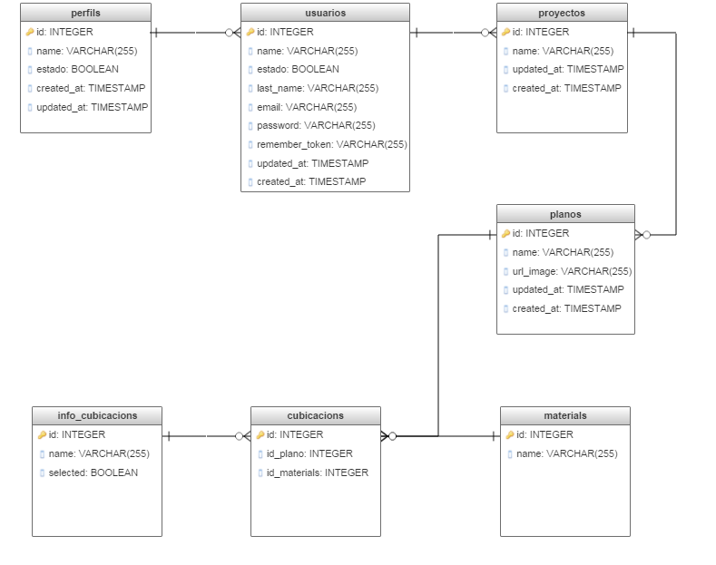

# Proyecto de título empresa "Polex"

## Laravel Official Documentation

Documentation for the framework can be found on the [Laravel website](http://laravel.com/docs).

##Instalación

1.- Instalar composer en la carpeta del proyecto, con el siguiente comando "composer install". 
2.- Actualizar la key del proyecto, con el siguiente comando"php artisan key:generate". 
3.- Configurar el archivo .env para la conexión a la bd. 
4.- Generar las tablas en la bd con el siguiente comando "php artisan migrate". 
5.- Llenar con información de prueba las tablas con el siguiente comando "php artisan db:seed" (si te arroja error prueba con el comando "composer dumpautoload"). 

##Imagen modelo

